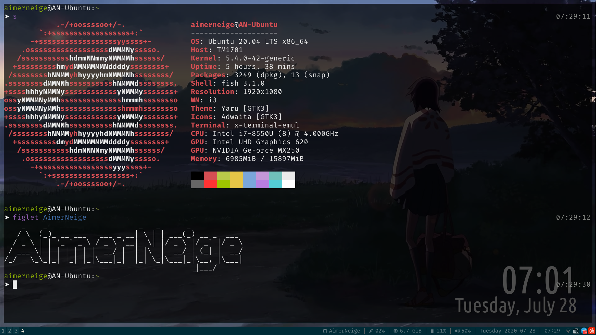

# i3-status config

## About

My own i3-status config.

## Preview



## Requirement

- you must have i3status installed

## Usage

```sh
# First, clone this repositories to your computer
git clone https://github.com/AimerNeige/i3status.git

# Then, move this folder to the ~/.config/
mv i3status/ ~/.config/

# Finally, restart the i3 with `Super + Shift + R`
```

